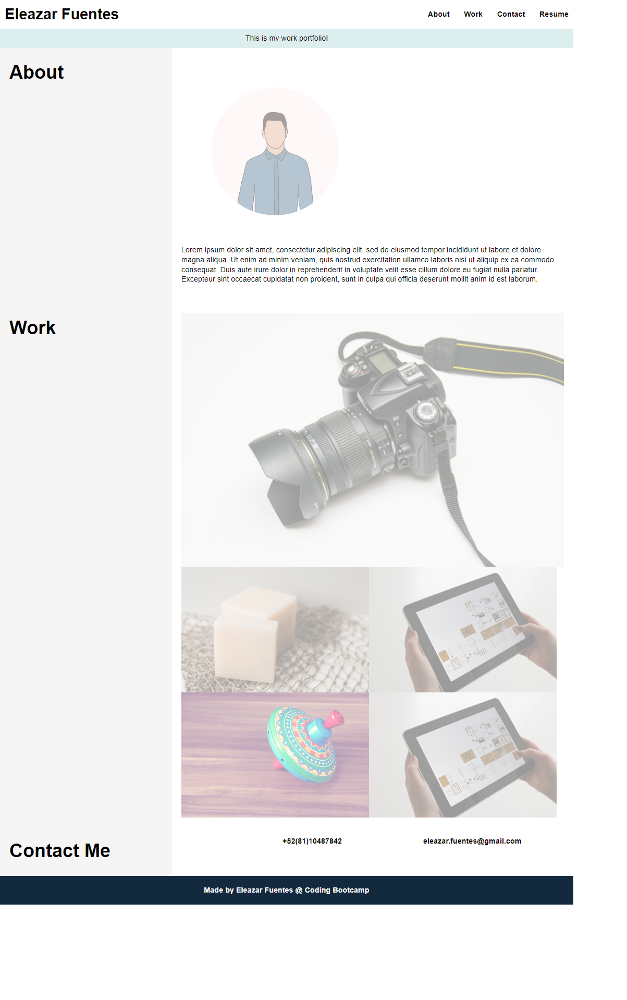

# ProfessionalPortfolio
This is my professional portfolio website

# Module 2 Challenge

## Description:<br>
Module 2 Challenge professional portfolio project. I design a portfolio web page trying to cover the technical aceptance criteria.<br>

## Screenshot<br>

<br>

## link to the project <br>
https://eleazarf.github.io/ProfessionalPortfolio/<br>

## Code<br>
### style.css changes commited<br>
```CSS
* {
    margin: 0;
    padding: 0;
    box-sizing: border-box;
}

div#banner {
    display: flex;
    position: relative;
    top: 0;
    left: 0;
    background-color: #DDEEEE;
    width: 100%;
}

div#banner-content {
    display: flex;
    width: auto;
    margin: 0 auto;
    padding: 10px;
}

body {
    margin: 0;
    display: flex;
    flex-direction: column;
    line-height: 1.3;
    font-family: sans-serif;
}

header {
    display: flex;
    justify-content: space-between;
    align-items: center;
    padding: 1%;
    background-color: white;
    color: #fff;
}

h1 {
    font-size: 200%;
}

h2 {
    margin: 2% 0;
    font-size: 250%;
}

.main-header {
    display: flex;
    /* Defines how to distribute the empty space between child elements */
    justify-content: space-between;
    padding: 10px;
    background: white;
    color: black;
}

nav {
    display: flex;
    justify-content: flex-end;
}

nav ul {
    display: flex;
    justify-content: space-between;
    min-width: 300px;
}

nav a {
    color: black;
    font-weight: bold;
    text-decoration: none;
}

nav a:hover {
    text-decoration: underline;
}

nav p {
    padding: 14px 20px;
    text-decoration: none;
}

main {
    display: flex;
    flex-wrap: wrap;
}

aside {
    flex: 30%;
    background-color: whitesmoke;
    padding: 20px;
    flex-wrap: wrap;
}

section {
    flex: 70%;
    background-color: #fff;
    padding: 20px;
    width: 30%;
}

footer {
    padding: 20px;
    text-align: center;
    background: #13293d;
    color: #fff;
}

/* Image Placeholders */
.sample-img {
    background-color: #fff;
    width: 100%;
    padding: 20px;
    height: 200px;
    border: 1px solid black;
}

.products {
    flex: 4;
    background-color: #fff;
    padding: 20px;
    display: flex;
    flex-wrap: wrap;
    justify-content: center;
}

.card {
    flex: 1 100%;
    padding: 10px;
}

/* Work images flex container */

.flex-container {
    display: flex;
    flex-wrap: wrap;
}

.flex-container img {
    flex: 0 0 20%;
    width: 400px;
    height: auto;
}

.flex-container img:nth-child(1) {
    flex: 0 0 100%;
    height: auto;
    /* The frist image takes up 100% of the container width */
}

img {
    opacity: 0.4;
    filter: alpha(opacity=40);
}

img:hover {
    opacity: 1.0;
    filter: alpha(opacity=100);
}

.smallpic {
    flex: 0 0 20%;
    width: 400px;
    height: auto;
}
```
### HTML changes commited<br>
```html
<!DOCTYPE html>
<html>

<head>
  <title>Eleazar's Profesional Portfolio</title>
  <meta charset="UTF-8" />
  <meta name="viewport" content="width=device-width, initial-scale=1" />
  <link rel="stylesheet" href="./assets/css/reset.css" />
  <link rel="stylesheet" type="text/css" href="./assets/css/style.css" />
</head>

<body>
  <!-- Header -->
  <header class="main-header">
    <h1>Eleazar Fuentes</h1>
    <nav>
      <ul>
        <li><a href="#about">About</a></li>
        <li><a href="#work">Work</a></li>
        <li><a href="#contact">Contact</a></li>
        <li><a href="https://www.linkedin.com/in/eleazarfuenteso/">Resume</a></li>
      </ul>
    </nav>
  </header>

  <!-- Navbar -->
  <div id="banner">
    <div id="banner-content">
      This is my work portfolio!
    </div>
  </div>

  <!-- Body -->
  <main>
    <aside>
      <h2 id="about">About</h2>
    </aside>
    <section>
      <div class="flex-container smallpic">
        
      </div>
      <p>Lorem ipsum dolor sit amet, consectetur adipiscing elit, sed do eiusmod tempor incididunt ut labore et dolore
        magna aliqua. Ut enim ad minim veniam, quis nostrud exercitation ullamco laboris nisi ut aliquip ex ea commodo
        consequat. Duis aute irure dolor in reprehenderit in voluptate velit esse cillum dolore eu fugiat nulla
        pariatur. Excepteur sint occaecat cupidatat non proident, sunt in culpa qui officia deserunt mollit anim id est
        laborum.</p>
      <br />
    </section>

    <aside>
      <h2 id="work">Work</h2>
    </aside>
    <section>
      <!-- Product Cards -->
      <div class="flex-container">
        
        
        
        
        
      </div>
    </section>

    <aside>
      <h2 id="contact">Contact Me</h2>
    </aside>
    <section>
      <nav>
        <ul>
          <li><a href="#">+52(81)10487842</a></li>
        </ul>
        <ul>
          <li><a href="#">eleazar.fuentes@gmail.com</a></li>
        </ul>
      </nav>
      <br />
    </section>
  </main>

  <!-- Footer -->
  <footer>
    <h3>
      Made by Eleazar Fuentes @ Coding Bootcamp
    </h3>
  </footer>
</body>

</html>
```
